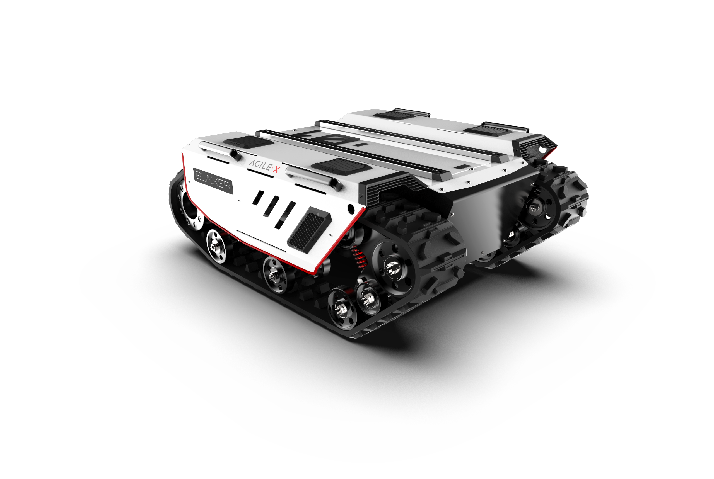
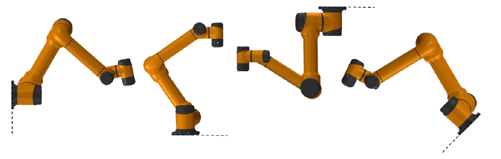
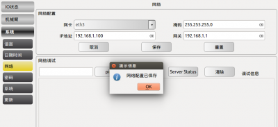
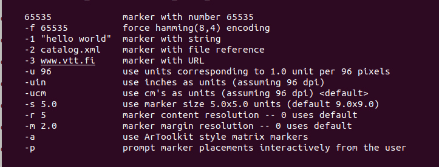
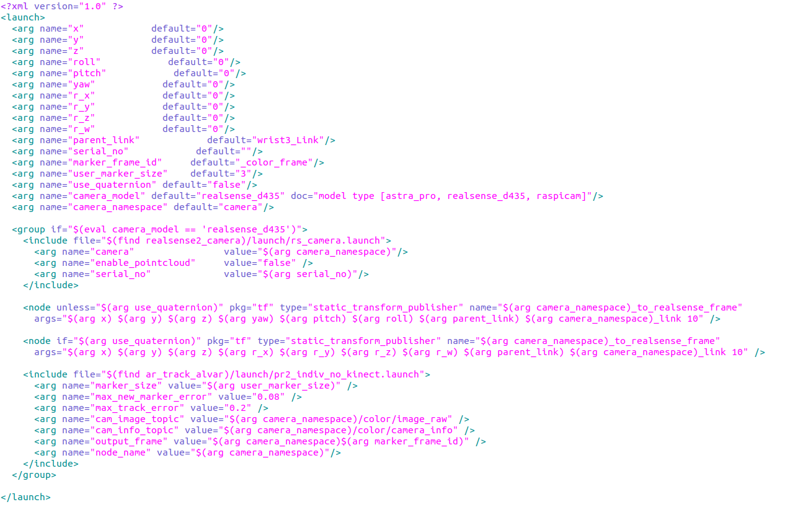
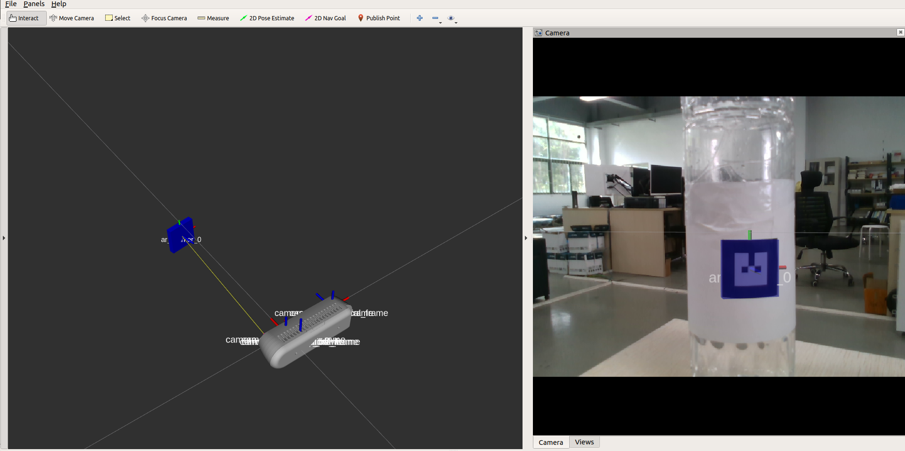
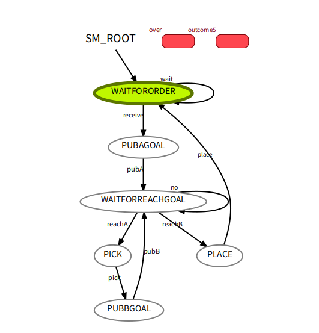
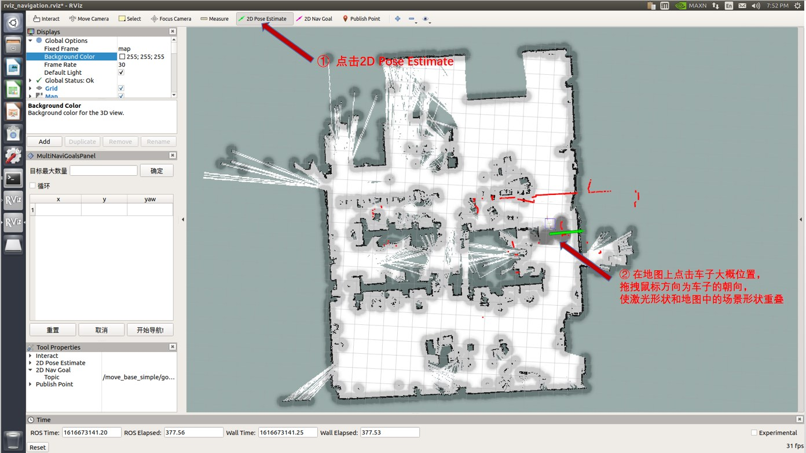
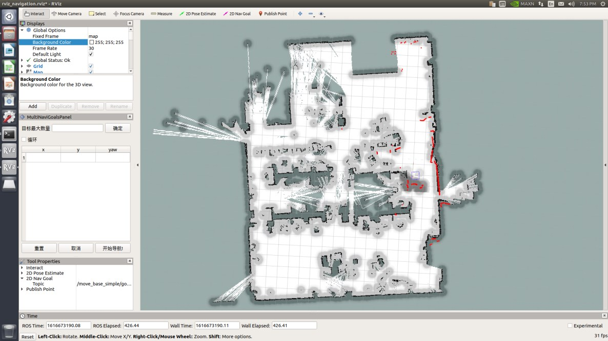

# 松灵机器人产品Agile 复合移动机器人开发套件用户指导手册


------

[TOC]

------


## 0 产品简介

Agile 复合移动机器人系列开发套件是松灵机器人专为行业科研教育应用客户研发开发的高级开发套件，面对科研教育对机器人产品越来越灵活的，该套装基于松灵机器人ROS生态体系统，集成高性能工控、高精度LiDAR、多传感器、多自由度机械臂、视觉感知搭配于一身。套件包含了多线激光雷达自主导航、机械臂moveIt运动控制规划、视觉识别、机械臂自主抓取等功能于一体，解决客户在面对移动机器人在复杂应用场景下的技术复杂度高、集成难度高的特征，给客户带来极致的用户体验。产品包含完整的技术手册与配套的技术文档、代码采用全开源的形式，降低客户的应用和学习难度。产品套件可以广泛用于农业、智能制造、教育实训、科研探索等方向。


------


## 1 主要配置清单以及参数说明
### 1.1各版本主要配置对比
| 套件版本 | Agile Pro | Agile Stand （coming soon）| Agile Lite （coming soon）|
| :----: | :----: | :----: |:----:|
| 底盘移动平台 | BUNKER | SCOUT / RANGER MINI | SCOUT MINI(OMNI)|
| 机械臂 | Aubo i3/5 |  x-ARM lite | Mycobot lite/ Pro|
| 机械臂夹爪 | 大寰AG 95 | x-ARM  真空吸头 | Mycobot 真空吸头|
| 工控机 | x-7010(i7 16G 256SSD) |x-7010(i7 16G 256SSD) |x-7010(i7 16G 256SSD) |
| 视觉传感器|  RealSense D435 | RealSense D435 |RealSense D435 |
| 激光雷达传感器 | VLP 16 | VLP 16 |  VLP 16 |
| 屏幕 | 触摸式显示屏 | 触摸式显示屏 |触摸式显示屏 |
| 路由器 | B316 4G路由器 |B316 4G路由器 |B316 4G路由器 |
|  |  | | |

### 1.2主要配件介绍

* #### BUNKER 产品介绍
  BUNKER是一款全能型行业应用的履带式底盘车。它具有操作简单灵敏，开发空间大，适应多种领域开发应用，独立悬挂系统，重载避震，爬坡能力强，可爬楼梯等特点，可用于巡检勘探、救援排爆、特种拍摄、特种运输等特种机器人开发，解决机器人移动方案。

  |     项目     |       指标        |
  | :----------: | :---------------: |
  |   外形尺寸   |  1000*750*360mm   |
  |   内仓尺寸   |   600*300*230mm   |
  |   底盘高度   |       90mm        |
  |   履带宽度   |       150mm       |
  |   接地长度   |       520mm       |
  |     自重     |      约130kg      |
  |     载重     |       70kg        |
  |     类型     |      锂电池       |
  |     容量     |       30AH        |
  |     电压     |        48V        |
  |   最大爬坡   |        35°        |
  |   运行速度   |     0~1.5m/s      |
  | 最小转弯半径 |    可原地自转     |
  |   最大越障   |       170mm       |
  |   控制模式   |     遥控控制      |
  |    遥控器    | 2.4G /极限距离1KM |
  |   通讯接口   |        CAN        |
  
* #### Aubo 机械臂介绍
  Aubo系列机器人是松灵机器人根据科研教育行业严选出来来的一款工业级轻量级协作机器人产品，产品采用关节模块化设计，使用面向开发者层面的机器人系统。用户可根据Aubo平台提供的应用程序接口，开发属于自己的机器人控制系统；此外，AUBO机器人配有专用的可编程操作界面，用户可通过此界面实时观察机器人的运行状态，对机器人进行诸多控制设置，也可脱机进行离线仿真，极大地提升了实际应用的工作效率.。同时我们根据科研教育行业的特点，适配ROS，支持Moveit等开源方案支持。

  
  
  |             机器人类型             |                    **AUBO-i5**                    |
  | :--------------------------------: | :-----------------------------------------------: |
  |                重量                |                      24  kg                       |
  |              有效负载              |                       5  kg                       |
  |                延伸                |                      924  mm                      |
  |              关节范围              |                  -175°  ~ +175°                   |
  |              关节速度              |        1-3关节：150°/s    4-6关节：180°/s         |
  |              工具速度              |                     ≤2.8 m/s                      |
  |            重复定位精度            |                    ±  0.02 mm                     |
  |              占地面积              |                     Ø172  mm                      |
  |               自由度               |                    6个旋转关节                    |
  | 标准控制柜尺寸（长*****高*****宽） |                727mm *623mm*235mm                 |
  |            **I/O** 电源            |    控制柜中为24V 3A，工具中为 0V/12V/24V  0.8A    |
  |              通信协议              |            Ethernet、Modbus  - RTU/TCP            |
  |            接口与开放性            | SDK（支持C\C++\Lua\Python开发）、支持ROS系统、API |
  |                编程                |     在12.5寸触摸屏的AUBOPE图形用户界面上进行      |
  |                噪声                |                      噪声小                       |
  |           **IP**防护等级           |                      IP  54                       |
  |                功耗                |            运行典型的程序时大约为200W             |
  
  
  
* ### X-7010工控机介绍
  X-7010是一款模块化组合的高性能超小工控机，针对移动机器人行业算力要求高，环境要求高的特征而定制的一款工业工控控制电脑。它采用Intel 平台，支持8/9th 35W高速处理器。它采用高效热管的大面积铝鳍和PWM风扇的主/被动双重散热设计，通过模具打造的全铝合金强固机身，保证其长寿命稳定运行。适用于智能机器人、无人驾驶、机器视觉、智慧城市等高运算要求领域。预装Ubuntu 18.04， ROS Melodic（Full Desktop) 版本，以及一些机器人开发常见得开发环境，实现开机即用。

  * 具有巴掌大小紧凑超小机身；
  
  * 支持Intel 8th桌面级高性能CPU；
  
  * 搭载热管与智能风扇的主被动高效散热；
  
  * 支持miniPCIE、NVME等多种加速卡扩展方案；
  
  * 多路超高速专用串口，适配多种雷达应用；
  
  * 多通道USB3.1 Gen2与双千兆网络的高速通讯；
  
  * 坚固的模具成型的铝合金机身，符合车载振动冲击；
  
  * -20~60℃宽温工作；
  
    
  
* ### 视觉传感器RealSense D435
  双目视觉传感器，在机器人视觉测量、视觉导航等机器人行业方向中均有大范围的应用场景和需求，目前我们甄选了了在科研教育行业常见的视觉传感器。英特尔实感深度摄像头 D435 配备全局图像快门和宽视野，能够有效地捕获和串流移动物体的深度数据，从而为移动原型提供高度准确的深度感知。

  
  
* |              | **型号**             | **Intel Realsense D435** |
  | ------------ | -------------------- | ------------------------ |
  | 基本特征     | 应用场景             | 户外/室内                |
  | 测量距离     | 约10米               |                          |
  | 深度快门类型 | 全局快门/3um X 3um   |                          |
  | 是否支持IMU  | 支持                 |                          |
  | 深度相机     | 深度技术             | 有缘红外                 |
  | FOV          | 86° x 57°（±3°）     |                          |
  | 最小深度距离 | 0.105m               |                          |
  | 深度分辨率   | 1280 x 720           |                          |
  | 最大测量距离 | 约10米               |                          |
  | 深度帧率     | 90 fps               |                          |
  | RGB          | 分辨率               | 1280 x  800              |
  | FOV          | 69.4° × 42.5°（±3°） |                          |
  | 帧率         | 30fps                |                          |
  | 其他信息     | 尺寸                 | 90mm x 25mm x 25mm       |
  | 接口类型     | USB-C  3.1           |                          |

  

* ### 雷达传感器
  VLP-16 是 Velodyne 激光雷达中小巧而先进的一款产品。与同等价位的传感器相比，VLP-16 性价比更高，并且保留了 Velodyne 在激光雷达方面比较有突破性的一些主要特点，如实时、360°、三维坐标和距离、附带校准的反射率测量。

  VLP-16 测量范围可达 100 m，功耗低（约 8 W），重量轻（约 830 g），体积小（Ø103mm x 72mm），具备双重返回性能，这些特点使它成为背包式测量、无人机挂载和其它移动设备的理想选择。

  
  
  | 项目         | 参数                              |
  | ------------ | --------------------------------- |
  | 最大测距     | 100m                              |
  | 测距精度     | ±3cm                              |
  | 扫描速率     | 单次回波30万点/秒 双回波60万点/秒 |
  | 垂直视角     | -15°~＋15°                        |
  | 垂直角分辨率 | 2°                                |
  | 扫描频率     | 5Hz~20Hz                          |
  | 安全等级     | Class 1                           |
  | 重量         | 830g                              |
  | 功耗         | 8W                                |
  | 电压         | 9V~18V                            |
  | 工作温度     | -10℃~＋60℃                        |
  
* ### 机械夹爪
  大寰机器人AG 95 电动夹爪拥有两个自适应平行机械 关节手指 （后指代 关节手指每个 关节手指 由多个连杆机构和一个弹簧组成，如图 1.1 所示。 关节手指 可以与一个物体进行多达 5 个接触点的接触。 关节 手指采用欠驱动控制方式驱动，使得电机比 关节的总数要少。这种设计简化了抓取的控 制方式，使 关节手指 可以自动适应它们所抓取的物体形状。
  
  
  
  | 最大推荐负载             | 3-5kg*                                                 |
  | ------------------------ | ------------------------------------------------------ |
  | 手指开合行程（编程可调） | 0-95mm                                                 |
  | 抓持力（编程可调）       | 45-160N                                                |
  | 最快手指开合速度         | 190mm/s                                                |
  | 自身重量                 | 1kg                                                    |
  | 手指重复定位精度         | 0.03mm                                                 |
  | 通讯协议                 | TCP/IP,  USB2.0, RS485, I/O, CAN2.0A, EtherCAT（选配） |
  | 工作电压                 | 24V  DC±10%                                            |
  | 工作温度范围             | 0~50℃                                                  |


------


## 2 硬件安装与电气说明

### 1. 硬件系统构成

履带式复合移动机器人项目整体上采用四部分构成，履带式移动机器人底盘、控制箱体、机械臂本体及其感知单元、交互单元构成。控制箱体主要包括了工控机、路由器、稳压模块、机械臂示教器灯构成。具体其位置如下图所示。


### 2.硬件拓扑连接说明


## 3 仿真测试（Coming soon）


## 4 实例开发

### 1.基础使用

1. BUNKER使用
2. 机械臂的使用
3. 复合移动机器人的使用

### 2.开发前准备

#### 1.IP设置

电脑的开机密码是agx。路由器的密码和登录密码一致都是12345678.

设置机械臂网络参数：

- 进入【设置】->【系统】->【网络】；
- 选择网卡（一般只有唯一选项）；
- 在“IP地址”中设置机器人的IP，需要和PC（此处PC为工控机）在同一网段，即前3段一致，如设置为192.168.1.100；
- 在“掩码”填入255.255.255.0；
- 在“网关”中填入192.168.1.1。网关填写要求：前3段和IP一致，最后一位为1；
- 点击【保存】
- 重启机械臂。<font color=red>这一步很重要，只有重启了机器人，网络参数才会生效。</font>



#### 2.使用ar_track_alvar实现视觉定位追踪

2.1功能简介

这个包是一个开源 AR 标签跟踪库 Alvar 的 ROS PACKAGE。

（1） ar_track_alvar 有 4 个主要功能： 生成不同大小、分辨率和数据/ID 编码的 AR 标签

（2）识别和跟踪单个 AR 标签的姿势，可选择集成深度相机的深度数据以获得更好的姿势估计。    

（3）识别和跟踪由多个标签组成的组合姿势。这允许更稳定的姿态估计、对遮挡的鲁棒性以及对多边对象的跟踪。    

（4）使用相机图像自动计算捆绑中标签之间的空间关系，这样用户就不必手动测量并在 XML 文件中输入标签位置来使用捆绑功能（目前不工作）。

 Alvar 比 ARToolkit 更新、更先进，ARToolkit 一直是其他几个 ROS AR 标签包的基础。 Alvar 具有自适应阈值处理以处理各种光照条件、基于光流的跟踪以实现更稳定的姿态估计，以及改进的标签识别方法，该方法不会随着标签数量的增加而显着减慢。 

2.2使用说明

（1）安装ar_track_alvar

```bash
$ sudo apt-get install ros-<distro>-ar-track-alvar
```

or源码安装

```bash
$ git clone https://github.com/ros-perception/ar_track_alvar.git
$ cd your_workspace && catkin_make
```

(2)生成标签

```bash
$ source ~/catkint_workspace/devel/setup.bash
$ rosrun ar_track_alvar createMarker 0 
```

>  后面的数字表示生成标签的id号，可以根据需要生成不同数字的标签

详细的参数设置如下图：



（3）打印标签

打印标签时注意尺寸，默认使用3x3 cm的标签，如果打印尺寸和默认尺寸不同，请在~/your_workspace/src/open_manipulator_perceptions/open_manipulator_ar_markers/launch/agx_ar_pose.launch文件中修改标签尺寸。

```xml
  <arg name="user_marker_size"	  default="3"/>
```

> 在使用过程中默认0号标签贴在物体上，2号标签贴在物品摆放平台上。

（4）运行识别功能

用usb3.0的线连接摄像头与电脑，运行下面指令

```bash
$source ~/catkin_workspace/devel/setup.bash
$roslaunch agx_aubo_bringup agx_ar_pose.launch
```

其agx_ar_pose.launch文件的结构如下图所示，详细参数参照下表：



|       参数       |     默认值     |                     功能                     |
| :--------------: | :------------: | :------------------------------------------: |
|      x,y,z       |       0        |        摄像头固定在机械臂中的静态位置        |
|  roll,pitch,yaw  |       0        | 摄像头固定在机械臂中的静态姿态欧拉角表示形式 |
| r_w,r_x,r_y,r_z  |       0        | 摄像头固定在机械臂中的静态姿态四元数表示形式 |
|   parent_link    |  wrist3_Link   |           摄像头发布tf的相对坐标系           |
|    serial_no     |       空       |              启动摄像头的序列号              |
| user_marker_size |       3        |             标签的尺寸大小（cm）             |
|  use_quaternion  |     false      |             是否用四元数表示姿态             |
|   camera_model   | realsense_d435 |                  摄像头模型                  |
| camera_namespace |     camera     |                摄像头命名空间                |



#### 3.使用Gmapping构建地图

3.1功能简介

  gmapping功能包订阅机器人的深度信息、IMU信息和里程计信息，同时完成一些必要参数的配置，即可创建并输出基于概率的二维栅格地图。gmapping功能包基于openslam社区的开源SLAM算法。在ROS的软件源中已经集成了gmapping相关功能包的二进制安装文件，可以使用如下命令进行安装：

```bash
$ sudo apt-get install ros-kinetic-gmapping
```

或者可以选择源码安装

```bash
$ cd ~/catkin_workspace/src
$ git clone https://github.com/ros-perception/slam_gmapping.git
$ git clone https://github.com/OpenSLAM-org/openslam_gmapping.git
$ cd ..
$ catkin_make
```

3.2功能运行

```bash
$ roslaunch agilexpro open_lidar.launch
$ roslaunch agilexpro gmapping.launch
```

 构建好地图之后，把地图保存在~/catkin_workspace/src/agilexpro/maps目录下

```bash
$ rosrun map_server map_saver -f ~/catkin_workspace/src/agilexpro/maps/map
```

> 最后面的map是生成地图的名字，在导航的时候默认是加载以map命名地图文件，如果在命名的时候取了别的名字需要修改加载地图的名字。把~catkin_workspace/src/agilexpro/launch/navigation_4wd.launch文件中下面地图名字改为你命名的名字。
>
> ```xml
> <node name="map_server" pkg="map_server" type="map_server" args="$(find agilexpro)/maps/map.yaml" output="screen">
> ```

#### 4.使用move_base导航

4.1功能简介

move_base 包提供了一个动作的实现（参见 actionlib 包），给定世界上的目标，它将尝试使用移动基地来实现它。move_base 节点将全局和本地规划器链接在一起以完成其全局导航任务。move_base 节点还维护两个成本地图，一个用于全局规划器，另一个用于本地规划器（参见 costmap_2d 包），用于完成导航任务。 

4.2功能运行

```bash
$roslaunch agilexpro open_lidar.launch
$roslaunch agilexpro navigation.launch
```


#### 5.使用smach库实现任务状态切换

4.1功能简介

SMACH中明确描述所有可能的状态和状态转换，在机器人执行一些复杂的计划时，很有用。 这基本上消除了将不同模块组合在一起的冲突，使移动机器人操控等系统做更多有趣的事情

4.2功能运行

```bash
$source ~/catkin_workspace/devel/setup.bash
$ rosrun agx_aubo_smach smach_demo.py 
```



### 2.两点之间抓取投放演示

> 下面指令执行之前需要source工作空间

#### 1. 启动机械臂

```bash
$ roslaunch agx_aubo_bringup setup_arm.launch
```

>  开启机械臂控制柜的电源，解锁机械臂每个关节的保险。长按机械臂控制柜上连接的示教显示屏上的电源按钮，在弹出的小窗口点击保存->启动，就开启了机械臂的电气开关。

在这个launch file里面可支持修改一个参数，robot_ip。这里传入的ip为机械臂控制柜默认ip192.168.1.100。

```xml
<launch>
	<arg name="robot_ip" default="192.168.1.100" />
	<include file="$(find aubo_i5_moveit_config)/launch/moveit_planning_execution.launch">
		<arg name="robot_ip" value="$(arg robot_ip)"/>
	</include>
</launch>
```


 #### 2.启动摄像头

```bash
$ roslaunch agx_aubo_bringup open_camera.launch
```

> 注意启动之前需要用USB3.0的数据线连接摄像头与工控机。

该launch file支持修改的参数有下面几个：

```xml
<arg name="camera_namespace" value="cam1"/>
    <arg name="serial_no" value="035422071503"/>
    <arg name="node_name" value="cam1"/>
<arg name="use_quaternion" value="true"/>
    <!--<arg name="roll" value="0"/>
    <arg name="pitch" value="-1.57"/>
    <arg name="yaw" value="-1.57"/>
    <arg name="x" value="0.05"/>
    <arg name="y" value="0.03"/>
    <arg name="z" value="0.0"/>-->
    <arg name="x" value="0.0446414171704"/>
    <arg name="y" value="0.053996778351"/>
    <arg name="z" value="0.0600140964856"/>
    <arg name="r_x" value="-0.000283027265062"/>
    <arg name="r_y" value="-0.0682970373998"/>
    <arg name="r_z" value="0.984025866108"/>
    <arg name="r_w" value="0.164403556559"/>
```

camera_namespace：摄像头节点的命名空间，当启动多个摄像头时可以需要修改每个摄像头的命名空间。

serial_no：摄像头的序列号S/N码，当需要启动多个摄像头的时候可以传入摄像头的序列号指定打开某个摄像头。

node_name：一般与命名空间相同。

use_quaternion：true表示使用四元数，false表示使用欧拉角

x,y,z：摄像头距离机械臂的位置。

roll,pitch,yaw：摄像头姿态欧拉角。

r_x,r_y,r_z,r_w：摄像头姿态四元数。

在启动这个launch file的时候也启动了图像识别节点，会实时更新物体和物体摆放平台的空间坐标信息，可根据以下接口获取这两点信息。服务名字为/pick_point。服务类型为agx_pick_msg/AgxPickSrv ，详细的消息格式如下：

```
int32 q # 0--bottle;1--A;2--B
---
geometry_msgs/Point position
  float64 x
  float64 y
  float64 z
geometry_msgs/Quaternion orientation
  float64 x
  float64 y
  float64 z
  float64 w
```

其中q为0时，返回物体的坐标信息；q为2时，返回物体摆放位置信息。

 #### 3.启动机械爪

```bash
$ roslaunch agx_aubo_bringup open_gripper.launch
```

控制机械爪的服务接口为/pick_state,消息的类型为agx_pick_msg/PickStateSrv ，消息格式如下： 

```xml-dtd
int32 moterID  #机械爪的电机个数

int32 pose	#机械爪的指尖位置（mm）

int32 force	 #机械爪的抓取力度（N）
---
bool result
```

在dh_gripper_ros功能包里面有个一demo文件可以输入指尖位置来控制机械爪。使用指令如下：

```bash
$ rosrun dh_hand_driver demo_client 
```


#### 4. 启动agx_aubo_pick节点

```bash
$ roslaunch agx_aubo_bringup agx_aubo_bring.launch 
```

该节点需要获取状态机传入的taskid来分别控制机器人执行不同的任务。任务的服务接口为/send_task，服务类型为agx_pick_msg/TaskCmd，消息格式如下：

```xml-dtd
int32 taskID
geometry_msgs/PoseStamped A_goal
  std_msgs/Header header
    uint32 seq
    time stamp
    string frame_id
  geometry_msgs/Pose pose
    geometry_msgs/Point position
      float64 x
      float64 y
      float64 z
    geometry_msgs/Quaternion orientation
      float64 x
      float64 y
      float64 z
      float64 w
geometry_msgs/PoseStamped B_goal
  std_msgs/Header header
    uint32 seq
    time stamp
    string frame_id
  geometry_msgs/Pose pose
    geometry_msgs/Point position
      float64 x
      float64 y
      float64 z
    geometry_msgs/Quaternion orientation
      float64 x
      float64 y
      float64 z
      float64 w
---
bool result

```

#### 5. 启动smach状态机节点

```bash
$ rosrun agx_aubo_smach smach_demo.py
```

 定义了以下几种状态的转换：

```python
smach.StateMachine.add('WAITFORORDER', WaitFororder(),
       transitions={'receive':'PUBAGOAL',
   'wait':'WAITFORORDER'})
    
smach.StateMachine.add('PUBAGOAL', PubAGoal(),
       transitions={'pubA':'WAITFORREACHGOAL'})

smach.StateMachine.add('WAITFORREACHGOAL', WaitForReachGoal(),
    transitions={'no':'WAITFORREACHGOAL',
'reachA':'PICK',
'reachB':'PLACE'})

smach.StateMachine.add('PICK', Pick(),
       transitions={'pick':'PUBBGOAL'})

smach.StateMachine.add('PUBBGOAL', PubBGoal(),
       transitions={'pubB':'WAITFORREACHGOAL'})

smach.StateMachine.add('PLACE', Place(),
       transitions={'place':'WAITFORORDER'})
```

以上是整个系统的状态转换逻辑，可以根据需要添加相应的状态。以第一个状态为例，在这里定义了一个“WAITFORORDER”的状态，这个状态的类为WaitFororder，transitions代表状态的跳转。如果WaitFororder输出的结果为receive则跳转到“PUBAGOAL”，如果状态输出结果为wait，则跳转到“WAITFORORDER”状态。

#### 6. 启动雷达

```bash
$ roslaunch agilexpro open_lidar.launch
```

 

 #### 7.启动导航

```bash
$ roslaunch agilexpro navigation_4wd.launch
```

刚刚启动的时，程序默认车子在启动建图的位置，需要通过发布一个大概的位置加上
手柄旋转底盘校正。当激光形状和地图中的场景形状重叠的时候,校正完成。





导航的某点话题接口为/move_base_simple/goal，消息类型为geometry_msgs/PoseStamped，消息格式如下： 

```
std_msgs/Header header
  uint32 seq
  time stamp
  string frame_id
geometry_msgs/Pose pose
  geometry_msgs/Point position
    float64 x
    float64 y
    float64 z
  geometry_msgs/Quaternion orientation
    float64 x
    float64 y
    float64 z
    float64 w

```

到达某个点之后的反馈信息可以从/move_base/result话题获得，消息类型为base_msgs/MoveBaseActionResult ，消息格式如下：

```
std_msgs/Header header
  uint32 seq
  time stamp
  string frame_id
actionlib_msgs/GoalStatus status
  uint8 PENDING=0
  uint8 ACTIVE=1
  uint8 PREEMPTED=2
  uint8 SUCCEEDED=3
  uint8 ABORTED=4
  uint8 REJECTED=5
  uint8 PREEMPTING=6
  uint8 RECALLING=7
  uint8 RECALLED=8
  uint8 LOST=9
  actionlib_msgs/GoalID goal_id
    time stamp
    string id
  uint8 status
  string text
move_base_msgs/MoveBaseResult result

```

当机器人到达目标点后可以查看status为3。

#### 8.录制两点的坐标位置

```bash
$ rosrun agx_aubo_pick record
```

需要和步骤7相互配合，把小车控制移动到指定的位置，比如工件面前，大约1m的位置。根据提示，按下回车记录两个点的位置。

 #### 9.发送开始任务的指令

在场景中设置好两个地点作为一个夹取点和摆放点，通过步骤8录制好两个地点的坐标位置之后，使用下面的命令发送开始任务的指令。

```bash
$ roslaunch agx_aubo_pick  test.launch
```

在/goal_service服务上发送开始执行任务的请求，服务接口为/goal_service，服务类型为agx_pick_msg/OrderSrv消息格式如下，在agx_aubo_pick中有个demo文件可以参考运行。

```xml-dtd
int32 id
geometry_msgs/PoseStamped A_goal
  std_msgs/Header header
    uint32 seq
    time stamp
    string frame_id
  geometry_msgs/Pose pose
    geometry_msgs/Point position
      float64 x
      float64 y
      float64 z
    geometry_msgs/Quaternion orientation
      float64 x
      float64 y
      float64 z
      float64 w
geometry_msgs/PoseStamped B_goal
  std_msgs/Header header
    uint32 seq
    time stamp
    string frame_id
  geometry_msgs/Pose pose
    geometry_msgs/Point position
      float64 x
      float64 y
      float64 z
    geometry_msgs/Quaternion orientation
      float64 x
      float64 y
      float64 z
      float64 w
---
int32 result
```

切换遥控器为指令控制模式，则复合移动机器人开始导航到第一个地点抓取东西。

------


## **4 常见问题的处理与解答**


------

## 5 附图说明


## 6 其他说明

1. [遨博机械臂用户手册以及配套说明书]: 

   

2. VLP16 线激光雷达用户手册
